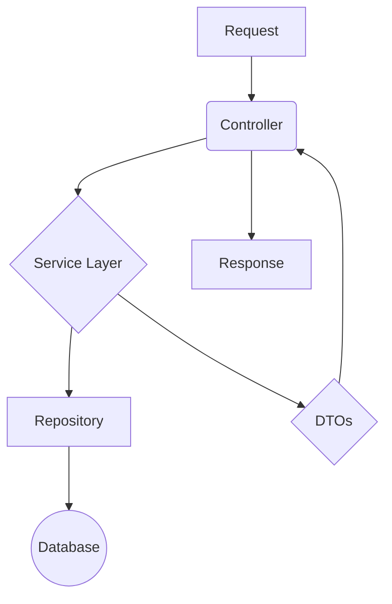

# API Blog - Backend

[](https://github.com/devc4rlos/api-blog/actions/workflows/laravel.yml)

[](https://conventionalcommits.org)
[](https://github.com/devc4rlos/api-blog/blob/main/LICENSE)
[](https://codecov.io/github/devc4rlos/api-blog)
[](https://api.carlosalexandre.com.br/v1)

Esta é a API RESTful para um sistema de blog, desenvolvida como um case de estudo de arquitetura de software robusta, escalável e de fácil manutenção, utilizando as melhores práticas do ecossistema Laravel.

O projeto vai além de um simples CRUD, implementando uma arquitetura em camadas bem definida, padrões de projeto modernos, uma suíte de testes completa e um **pipeline de deploy contínuo (CI/CD)** que garante a qualidade e a agilidade nas entregas.

## Principais Features e Funcionalidades

* **Autenticação e Autorização:** Sistema completo com Sanctum, incluindo login, logout, registro público e recuperação de senha.
* **Controle de Acesso Baseado em Papéis (RBAC):** Distinção clara entre usuários comuns e administradores, com permissões granulares definidas por Policies.
* **Gerenciamento de Conta (Self-Service):** Endpoints para que usuários autenticados possam visualizar e gerenciar seus próprios dados.
* **Gerenciamento de Usuários (Admin):** Endpoints para que administradores possam gerenciar todos os usuários do sistema.
* **Gerenciamento de Conteúdo (Posts e Comentários):** APIs completas para o CRUD de posts e comentários, com regras de negócio e de autorização.
* **Busca e Filtragem Avançada:** Sistema de consulta dinâmico via Padrão de Projeto Chain of Responsibility (Pipeline).
* **Upload de Arquivos:** Gerenciamento de upload de imagens para posts, com armazenamento desacoplado em **Amazon S3**, utilizando políticas de segurança via **IAM**.
* **Documentação Interativa:** Documentação completa e testável com OpenAPI (Swagger), disponível em ambiente de desenvolvimento.

## Destaques Técnicos e Arquiteturais

Esta seção detalha as decisões de arquitetura e as habilidades técnicas aplicadas no projeto.

### 1\. Arquitetura em Camadas (Layered Architecture)

A aplicação foi estruturada seguindo uma arquitetura limpa para garantir a separação de responsabilidades. Abaixo, um diagrama simplificado do fluxo de uma requisição:



**Skill em Destaque:** Design de Software, Arquitetura Limpa, SRP.

### 2\. Padrões de Projeto (Design Patterns)

Padrões como **Repository**, **Decorator**, **DTOs** e **Chain of Responsibility (CoR)** foram aplicados para criar um código flexível e reutilizável.
**Skill em Destaque:** Aplicação prática de Padrões de Projeto.

### 3\. Segurança (Security)

Uso de **Sanctum**, **Policies**, **Rate Limiting** customizado e prevenção de **Mass Assignment** via DTOs.
**Skill em Destaque:** Security Mindset, Defesa em Profundidade.

### 4\. Observabilidade (Observability)

**Logging Estruturado** com `X-Request-ID`, logging de eventos de negócio e **Health Checks** proativos.
**Skill em Destaque:** Foco em operações (DevOps) e monitoramento.

### 5\. Desempenho (Performance)

**Cache Inteligente** com invalidação automática via Eventos/Listeners e uso de **Jobs e Filas** para processamento assíncrono.
**Skill em Destaque:** Otimização, estratégias de cache e processamento assíncrono.

### 6\. Qualidade de Código e Testes

Distinção clara entre **Testes Unitários** e **Testes de Feature**, e uso de **Conventional Commits**.
**Skill em Destaque:** TDD/BDD, organização de versionamento.

### 7\. Documentação de API

API 100% documentada com **OpenAPI (Swagger)** de forma modular para uma melhor experiência do desenvolvedor (DX).
**Skill em Destaque:** Comunicação técnica clara e documentação de APIs.

### 8\. Integração com Cloud (AWS S3 & IAM)

Armazenamento de arquivos no **Amazon S3** com acesso seguro via usuário **IAM** com permissões mínimas (Least Privilege).
**Skill em Destaque:** Cloud Architecture, Segurança em Nuvem (IAM).

### 9\. Deploy Contínuo (CI/CD) e Containerização

O projeto é totalmente containerizado para produção usando um **Dockerfile multi-stage** otimizado, garantindo uma imagem final enxuta e segura. A orquestração dos serviços de aplicação, web server (Nginx) e worker é gerenciada com **Docker Compose**. O pipeline de **Deploy Contínuo (CD)**, construído com **GitHub Actions**, automatiza todo o processo: build da imagem, push para o **GitHub Container Registry (GHCR)** e deploy no servidor de produção via **SSH**.
**Skill em Destaque:** DevOps, CI/CD, Docker, GitHub Actions, Automação de Deploy.

## Tecnologias Utilizadas

* PHP 8.2+
* Laravel 12
* Docker (via Laravel Sail e para produção)
* Nginx
* Laravel Sanctum (Autenticação)
* l5-swagger (Documentação OpenAPI)
* PHPUnit (Testes)
* MySQL / SQLite (Banco de Dados)
* AWS S3 (Armazenamento de Arquivos)
* Redis (Cache e Filas)
* GitHub Actions (CI/CD)

## 🚀 Acessando a API (Live Demo)

A API está em produção e pode ser acessada publicamente.

* **URL Base da API:** `https://api.carlosalexandre.com.br/v1`

### 🔑 Autenticação

Para acessar os endpoints protegidos, obtenha um token de autenticação via `POST /v1/login` e inclua-o no cabeçalho de suas requisições: `Authorization: Bearer <SEU_TOKEN>`

### Exemplo Rápido com `curl`

1.  **Faça login para obter um token:**

    * *Você pode se registrar gratuitamente no endpoint `POST /v1/register` para criar um novo usuário.*

    <!-- end list -->

    ```bash
    curl -X POST https://api.carlosalexandre.com.br/v1/login \
      -H "Content-Type: application/json" \
      -H "Accept: application/json" \
      -d '{
        "email": "seu_email_cadastrado@email.com",
        "password": "sua_senha"
      }'
    ```

2.  **Acesse um endpoint protegido (ex: seus dados de conta):**

    * Use o token obtido no passo anterior.

    <!-- end list -->

    ```bash
    TOKEN="COLE_SEU_TOKEN_AQUI"

    curl -X GET https://api.carlosalexandre.com.br/v1/account \
      -H "Authorization: Bearer $TOKEN" \
      -H "Accept: application/json"
    ```

## 👨‍💻 Executando o Projeto Localmente

Se preferir executar o projeto em seu próprio ambiente para explorar a documentação ou contribuir.

### 📋 Pré-requisitos

* [Git](https://git-scm.com/)
* [Docker](https://www.docker.com/get-started)
* [Docker Compose](https://docs.docker.com/compose/install/)

### Com Laravel Sail (Recomendado)

1.  Clone o repositório: `git clone https://github.com/devc4rlos/api-blog.git && cd api-blog`
2.  Instale as dependências:
    ```bash
    docker run --rm \
        -u "$(id -u):$(id -g)" \
        -v "$(pwd):/var/www/html" \
        -w /var/www/html \
        laravelsail/php82-composer:latest \
        composer install --ignore-platform-reqs
    ```
3.  Copie e configure o `.env`: `cp .env.example .env` (e preencha as credenciais)
4.  Inicie os containers: `./vendor/bin/sail up -d`
5.  Execute o setup:
    ```bash
    ./vendor/bin/sail artisan key:generate
    ./vendor/bin/sail artisan migrate --seed
    ./vendor/bin/sail artisan l5-swagger:generate # Gera a documentação
    ```

O projeto estará disponível em `http://localhost`.

* **A documentação da API estará disponível em:** `http://localhost/api/documentation`

## ✅ Testes

Para garantir a qualidade e a estabilidade da API, execute a suíte de testes automatizados localmente.

```bash
# Executa todos os testes unitários e de feature do projeto
./vendor/bin/sail test
```

## 🤝 Como Contribuir

Contribuições são bem-vindas\! Sinta-se à vontade para abrir uma issue para relatar bugs e sugerir features, ou um pull request com melhorias.

## 📝 Licença

Este projeto está sob a licença MIT. Veja o arquivo `LICENSE` para mais detalhes.

## 👤 Autor

**Carlos Alexandre**

* **LinkedIn:** [https://linkedin.com/in/devc4rlos](https://linkedin.com/in/devc4rlos)
* **GitHub:** [https://github.com/devc4rlos](https://github.com/devc4rlos)
