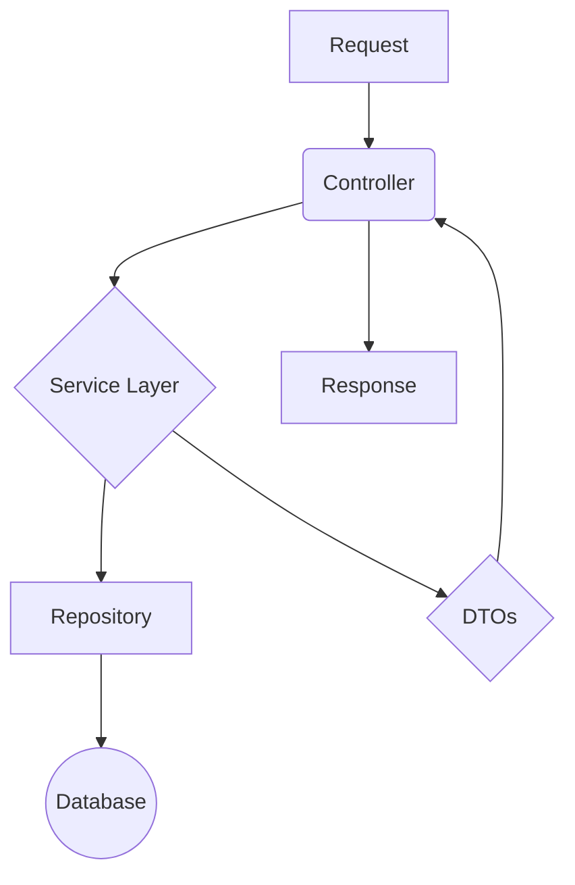

# API Blog - Backend

[](https://github.com/devc4rlos/api-blog/actions/workflows/laravel.yml)

[](https://conventionalcommits.org)
[](https://github.com/devc4rlos/api-blog/blob/main/LICENSE)
[](https://codecov.io/github/devc4rlos/api-blog)

Esta é a API RESTful para um sistema de blog, desenvolvida como um case de estudo de arquitetura de software robusta, escalável e de fácil manutenção, utilizando as melhores práticas do ecossistema Laravel.

O projeto vai além de um simples CRUD, implementando uma arquitetura em camadas bem definida, padrões de projeto modernos e uma suíte de testes completa para garantir a qualidade e a confiabilidade do código.

## Principais Features e Funcionalidades

* **Autenticação e Autorização:** Sistema completo com Sanctum, incluindo login, logout, registro público e recuperação de senha.
* **Controle de Acesso Baseado em Papéis (RBAC):** Distinção clara entre usuários comuns e administradores, com permissões granulares definidas por Policies.
* **Gerenciamento de Conta (Self-Service):** Endpoints para que usuários autenticados possam visualizar e gerenciar seus próprios dados.
* **Gerenciamento de Usuários (Admin):** Endpoints para que administradores possam gerenciar todos os usuários do sistema.
* **Gerenciamento de Conteúdo (Posts e Comentários):** APIs completas para o CRUD de posts e comentários, com regras de negócio e de autorização.
* **Busca e Filtragem Avançada:** Sistema de consulta dinâmico via Padrão de Projeto Chain of Responsibility (Pipeline).
* **Upload de Arquivos:** Gerenciamento de upload de imagens para posts, com armazenamento desacoplado em **Amazon S3**, utilizando políticas de segurança via **IAM**.
* **Documentação Interativa:** Documentação completa e testável com OpenAPI (Swagger).

## Destaques Técnicos e Arquiteturais

Esta seção detalha as decisões de arquitetura e as habilidades técnicas aplicadas no projeto.

### 1\. Arquitetura em Camadas (Layered Architecture)

A aplicação foi estruturada seguindo uma arquitetura limpa para garantir a separação de responsabilidades. Abaixo, um diagrama simplificado do fluxo de uma requisição:



**Skill em Destaque:** Design de Software, Arquitetura Limpa, SRP.

### 2\. Padrões de Projeto (Design Patterns)

Padrões como **Repository**, **Decorator**, **DTOs** e **Chain of Responsibility (CoR)** foram aplicados para criar um código flexível e reutilizável.
**Skill em Destaque:** Aplicação prática de Padrões de Projeto.

### 3\. Segurança (Security)

Uso de **Sanctum**, **Policies**, **Rate Limiting** customizado e prevenção de **Mass Assignment** via DTOs.
**Skill em Destaque:** Security Mindset, Defesa em Profundidade.

### 4\. Observabilidade (Observability)

**Logging Estruturado** com `X-Request-ID`, logging de eventos de negócio e **Health Checks** proativos.
**Skill em Destaque:** Foco em operações (DevOps) e monitoramento.

### 5\. Desempenho (Performance)

**Cache Inteligente** com invalidação automática via Eventos/Listeners e uso de **Jobs e Filas** para processamento assíncrono.
**Skill em Destaque:** Otimização, estratégias de cache e processamento assíncrono.

### 6\. Qualidade de Código e Testes

Distinção clara entre **Testes Unitários** e **Testes de Feature**, e uso de **Conventional Commits**.
**Skill em Destaque:** TDD/BDD, organização de versionamento.

### 7\. Documentação de API

API 100% documentada com **OpenAPI (Swagger)** de forma modular para uma melhor experiência do desenvolvedor (DX).
**Skill em Destaque:** Comunicação técnica clara e documentação de APIs.

### 8\. Integração com Cloud (AWS S3 & IAM)

Armazenamento de arquivos no **Amazon S3** com acesso seguro via usuário **IAM** com permissões mínimas (Least Privilege).
**Skill em Destaque:** Cloud Architecture, Segurança em Nuvem (IAM).

## Tecnologias Utilizadas

* PHP 8.2+
* Laravel 12
* Docker (via Laravel Sail)
* Laravel Sanctum (Autenticação)
* l5-swagger (Documentação OpenAPI)
* PHPUnit (Testes)
* MySQL / SQLite (Banco de Dados)
* AWS S3 (Armazenamento de Arquivos)
* Redis (Cache e Filas)

## 📋 Pré-requisitos

Antes de começar, certifique-se de que você tem as seguintes ferramentas instaladas em sua máquina:

* [Git](https://git-scm.com/)
* [Docker](https://www.docker.com/get-started)
* [Docker Compose](https://docs.docker.com/compose/install/) (geralmente já vem com o Docker Desktop)

## Como Executar o Projeto

### Com Laravel Sail (Recomendado)

O Laravel Sail oferece um ambiente de desenvolvimento local completo baseado em Docker.

1.  Clone o repositório:

    ```bash
    git clone https://github.com/devc4rlos/api-blog.git
    cd api-blog
    ```

2.  Instale as dependências do Composer:

    ```bash
    docker run --rm \
        -u "$(id -u):$(id -g)" \
        -v "$(pwd):/var/www/html" \
        -w /var/www/html \
        laravelsail/php82-composer:latest \
        composer install --ignore-platform-reqs
    ```

3.  Copie e configure o arquivo de ambiente:

    ```bash
    cp .env.example .env
    ```

    **Importante:** Abra o arquivo `.env` e configure as credenciais essenciais para o funcionamento do projeto:

    * **Banco de Dados:** `DB_HOST`, `DB_PORT`, `DB_DATABASE`, `DB_USERNAME`, `DB_PASSWORD`
    * **AWS S3 Bucket:** `AWS_ACCESS_KEY_ID`, `AWS_SECRET_ACCESS_KEY`, `AWS_DEFAULT_REGION`, `AWS_BUCKET`
    * **Serviço de E-mail (para recuperação de senha):** `MAIL_MAILER`, `MAIL_HOST`, `MAIL_PORT`, `MAIL_USERNAME`, `MAIL_PASSWORD`, `MAIL_FROM_ADDRESS`

4.  Inicie os containers do Sail:

    ```bash
    ./vendor/bin/sail up -d
    ```

5.  Execute os comandos de setup da aplicação:

    ```bash
    # Gere a chave da aplicação
    ./vendor/bin/sail artisan key:generate

    # Execute as migrações e seeders
    ./vendor/bin/sail artisan migrate --seed

    # Gere a documentação da API
    ./vendor/bin/sail artisan l5-swagger:generate
    ```

6.  Execute o worker da fila (em um novo terminal):
    Para que tarefas como o envio de e-mails de recuperação de senha funcionem, o worker da fila precisa estar em execução.

    ```bash
    ./vendor/bin/sail artisan queue:work
    ```

O projeto estará disponível em `http://localhost`.

## 🕹️ Uso da API

### 🔑 Autenticação

Para acessar os endpoints protegidos, obtenha um token de autenticação via `POST /api/login` e inclua-o no cabeçalho de suas requisições:
`Authorization: Bearer <SEU_TOKEN>`

### Exemplo Rápido com `curl`

1.  **Faça login para obter um token:**
    *Substitua `user@example.com` e `password` por um usuário criado pelo seeder.*

    ```bash
    curl -X POST http://localhost/v1/login \
      -H "Content-Type: application/json" \
      -H "Accept: application/json" \
      -d '{
        "email": "user@example.com",
        "password": "password"
      }'
    ```

    **Resposta esperada:**

    ```json
    {
      "token": "1|abcdefghijklmnopqrstuvwxyz123456"
    }
    ```

2.  **Acesse um endpoint protegido:**
    *Use o token obtido no passo anterior.*

    ```bash
    TOKEN="COLE_SEU_TOKEN_AQUI"

    curl -X GET http://localhost/v1/account \
      -H "Authorization: Bearer $TOKEN" \
      -H "Accept: application/json"
    ```

### 📖 Documentação dos Endpoints

A documentação completa e interativa da API está disponível via Swagger UI.

* **URL da Documentação:** `http://localhost/api/documentation`

*(Caso a documentação não apareça, lembre-se de executar o comando `./vendor/bin/sail artisan l5-swagger:generate`)*

## ✅ Testes

Para garantir a qualidade e a estabilidade da API, siga os passos abaixo para executar a suíte de testes automatizados.

### Com Laravel Sail

1.  **Preparar o banco de dados de teste:**
    Este comando irá limpar e recriar o banco de dados de teste para garantir um ambiente limpo para cada execução.

    ```bash
    ./vendor/bin/sail artisan migrate:fresh --seed --env=testing
    ```

2.  **Executar a suíte de testes:**
    Este comando executa todos os testes unitários e de feature do projeto.

    ```bash
    ./vendor/bin/sail test
    ```

## 🤝 Como Contribuir

Contribuições são bem-vindas\! Sinta-se à vontade para abrir uma issue para relatar bugs e sugerir features, ou um pull request com melhorias.

## 📝 Licença

Este projeto está sob a licença MIT. Veja o arquivo `LICENSE` para mais detalhes.

## 👤 Autor

**Carlos Alexandre**

* **LinkedIn:** [https://linkedin.com/in/devc4rlos](https://linkedin.com/in/devc4rlos)
* **GitHub:** [https://github.com/devc4rlos](https://github.com/devc4rlos)
